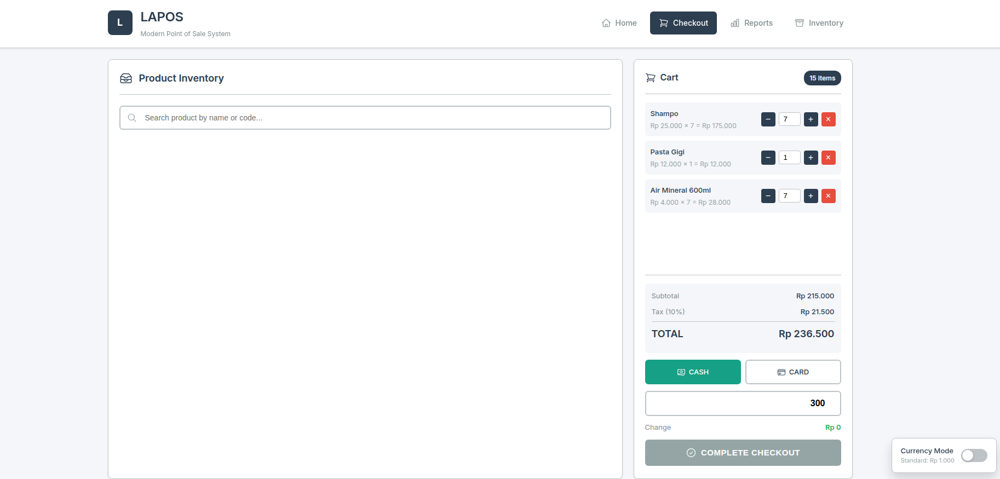
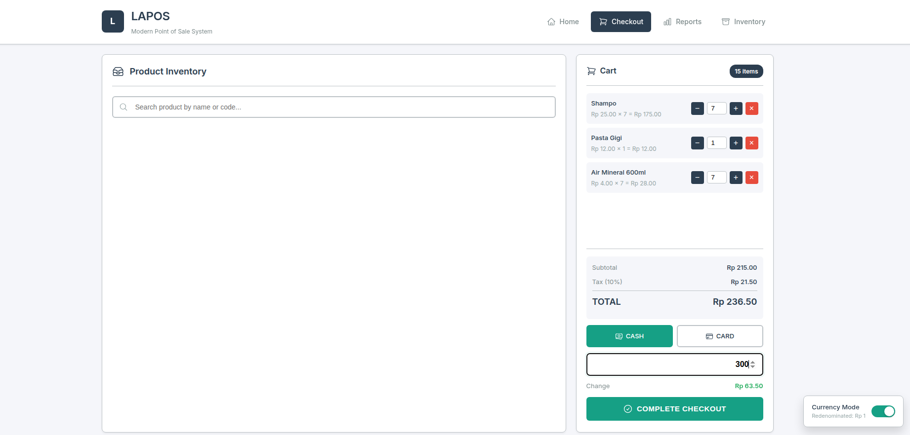

<div align="center">


# LAPOS
### 🏪 Modern Point of Sale System

<p align="center">
  <strong>Professional, Clean, and Efficient POS System for Retail Businesses</strong>
</p>

<p align="center">
  <a href="https://laravel.com">
    
  </a>
  <a href="https://php.net">
    
  </a>
  <a href="https://sqlite.org">
    
  </a>
  <a href="LICENSE">
    
  </a>
</p>

<p align="center">
  <a href="https://github.com/bicknicktick/LAPOS-kasir/stargazers">
    
  </a>
  <a href="https://github.com/bicknicktick/LAPOS-kasir/network/members">
    
  </a>
  <a href="https://github.com/bicknicktick/LAPOS-kasir/issues">
    
  </a>
</p>

<p align="center">
  <a href="#-features">Features</a> •
  <a href="#-installation">Installation</a> •
  <a href="#-usage">Usage</a> •
  <a href="#-screenshots">Screenshots</a> •
  <a href="#-contributing">Contributing</a> •
  <a href="#-support">Support</a>
</p>

<br>

<p align="center">
  <a href="https://e.bitzy.id">
    
  </a>
</p>

<p align="center">
  <a href="https://paypal.me/bitzyid">
    
  </a>
</p>

---

</div>

## ✨ Features

<table>
<tr>
<td width="50%">

### 💼 Business Features
- 📦 **Product Management** - Add, edit, delete products with stock tracking
- 💰 **POS System** - Fast and intuitive checkout interface
- 📊 **Reports** - Comprehensive sales reporting with export
- **Export to PDF** - Elegant minimalist report design
- **Export to Excel** - Detailed transaction data
- **Date Filtering** - Custom date range reports
- **Summary Dashboard** - Total revenue, cash, card payments
- 💳 **Multiple Payment Methods** - Cash and card support
- 🔄 **Currency Redenomination** - Ready for Indonesian Rupiah redenomination

</td>
<td width="50%">

### 🛠 Technical Features
- ⚡ **Lightning Fast** - Optimized for speed
- 📱 **Responsive Design** - Works on all devices
- 🔒 **Secure** - Built with security best practices
- 🎨 **Modern UI** - Clean and professional interface
- 🌐 **API Ready** - RESTful API for integrations

</td>
</tr>
</table>

## 🚀 Installation

<div align="center">

### 📋 Prerequisites

<table>
  <tr>
    <td align="center">
      <br>
      <sub>PHP 8.1 or higher</sub>
    </td>
    <td align="center">
      <br>
      <sub>Dependency Manager</sub>
    </td>
    <td align="center">
      <br>
      <sub>Database</sub>
    </td>
  </tr>
</table>

</div>

### ⚡ Quick Start

```bash
# 1️⃣ Clone the repository
git clone https://github.com/bicknicktick/LAPOS-kasir.git
cd LAPOS-kasir

# 2️⃣ Install dependencies
composer install

# 3️⃣ Setup environment
cp .env.example .env
php artisan key:generate

# 4️⃣ Create database
touch database/database.sqlite

# 5️⃣ Run migrations & seed data
php artisan migrate --seed

# 6️⃣ Start the server
php artisan serve
```

<div align="center">

🎉 **Done!** Visit `http://localhost:8000` in your browser

<br>


</div>

## 💻 Usage

### Default Access
Open your browser and navigate to the homepage. Click "Enter Application" to access the POS system.

### Main Features

#### 🛍️ Point of Sale
1. Search products by name or code
2. Add items to cart
3. Adjust quantities
4. Select payment method
5. Complete checkout

#### 📦 Product Management
- Navigate to **Inventory** to manage products
- Add new products with name, code, price, and stock
- Edit existing products
- Track stock levels with visual indicators

#### 📈 Reports
- View all transactions
- Filter by date
- Export reports
- Print receipts

## 📸 Screenshots

<div align="center">
<table>
<tr>
<td align="center" colspan="2">
<strong>Homepage - Clean & Minimalist</strong><br>

</td>
</tr>
<tr>
<td align="center">
<strong>POS - Normal Rupiah Format</strong><br>

</td>
<td align="center">
<strong>POS - Redenominated Currency</strong><br>

</td>
</tr>
</table>

### Key Features Shown:
- ✅ **Clean Homepage** - Minimalist design without flashy colors
- ✅ **Currency Toggle** - Switch between normal (Rp 1.000) and redenominated (Rp 1.00)
- ✅ **Real-time Search** - Fast product search with stock indicators
- ✅ **Professional Interface** - Clean, functional design like US supermarkets

</div>

## 🔧 Configuration

### Environment Variables

Key configuration options in `.env`:

```env
APP_NAME="LAPOS"
APP_ENV=production
APP_DEBUG=false

DB_CONNECTION=sqlite
CURRENCY_REDENOMINATION=false
CURRENCY_SYMBOL=Rp
```

### Currency Redenomination

To enable currency redenomination (remove 3 zeros from Indonesian Rupiah):

```env
CURRENCY_REDENOMINATION=true
```

## 🤝 Contributing

Contributions are welcome! Please feel free to submit a Pull Request.

1. Fork the repository
2. Create your feature branch (`git checkout -b feature/AmazingFeature`)
3. Commit your changes (`git commit -m 'Add some AmazingFeature'`)
4. Push to the branch (`git push origin feature/AmazingFeature`)
5. Open a Pull Request

## 📝 License

This project is licensed under the MIT License - see the [LICENSE](LICENSE) file for details.

## 💖 Support Development

<div align="center">

<h3>Love LAPOS? Support the Project!</h3>

<p>Your support helps us maintain and improve LAPOS with new features and updates.</p>

<br>

<a href="https://paypal.me/bitzyid" target="_blank">
  
</a>

<br><br>

<table>
  <tr>
    <td align="center" width="33%">
      <br>
      <sub>Give us a star</sub>
    </td>
    <td align="center" width="33%">
      <br>
      <sub>Fork and contribute</sub>
    </td>
    <td align="center" width="33%">
      <br>
      <sub>Report issues</sub>
    </td>
  </tr>
</table>

<br>

### 🎁 Why Donate?

- ☕ **Buy me a coffee** - Keep the developer caffeinated
- 🚀 **Faster updates** - More time for development
- 🐛 **Bug fixes** - Priority support for donors
- ✨ **New features** - Your suggestions come first

<br>

<p><em>Every contribution, no matter how small, makes a difference!</em></p>

</div>

## 🙏 Acknowledgments

- Built with [Laravel](https://laravel.com) - The PHP Framework for Web Artisans
- Icons from [Heroicons](https://heroicons.com)
- Font: [Inter](https://fonts.google.com/specimen/Inter)

## 📞 Contact & Links

<div align="center">

<br>

<table>
  <tr>
    <td align="center">
      <a href="https://e.bitzy.id">
        
      </a>
    </td>
    <td align="center">
      <a href="mailto:support@e.bitzy.id">
        
      </a>
    </td>
  </tr>
  <tr>
    <td align="center">
      <a href="https://github.com/bicknicktick/LAPOS-kasir">
        
      </a>
    </td>
    <td align="center">
      <a href="https://paypal.me/bitzyid">
        
      </a>
    </td>
  </tr>
</table>

<br>

### 💼 Need Custom Development?

<p>We offer custom POS solutions tailored to your business needs.</p>

<a href="mailto:support@e.bitzy.id?subject=Custom%20POS%20Development">
  
</a>

<br><br>

---

<br>

<p>
  <strong>Developed with ❤️ by <a href="https://e.bitzy.id">e.bitzy.id</a></strong>
</p>

<p>
  
  
  
</p>

<br>

<sub>© 2024 LAPOS - Powered by e.bitzy.id. All rights reserved.</sub>

<br><br>

<a href="#lapos">
  
</a>

</div>
