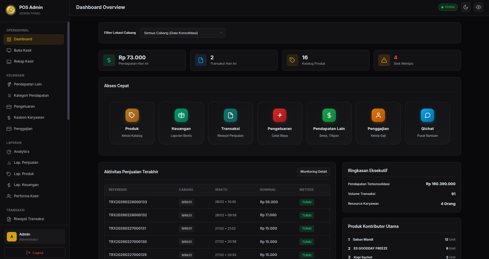
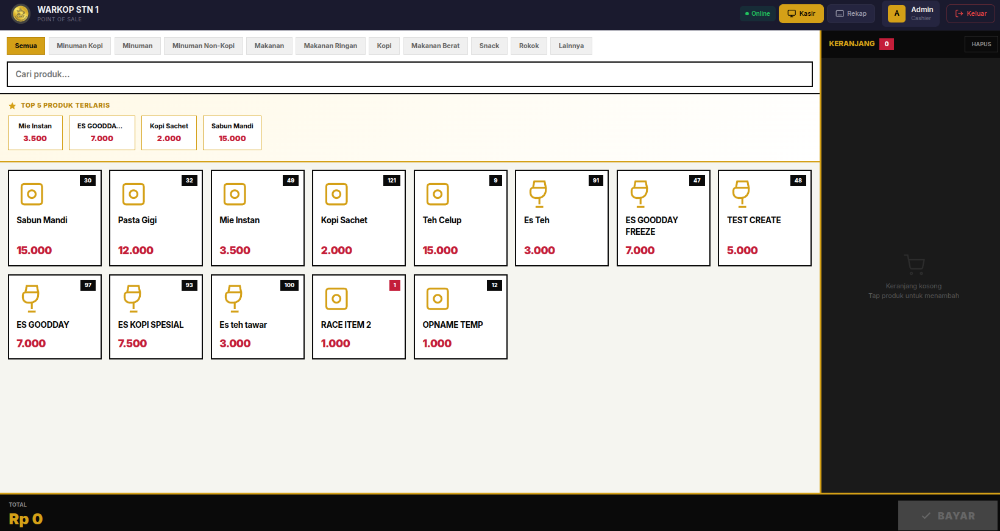
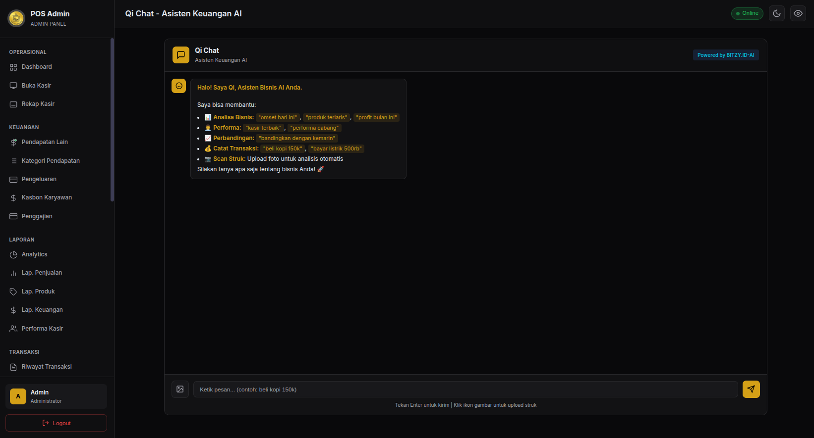
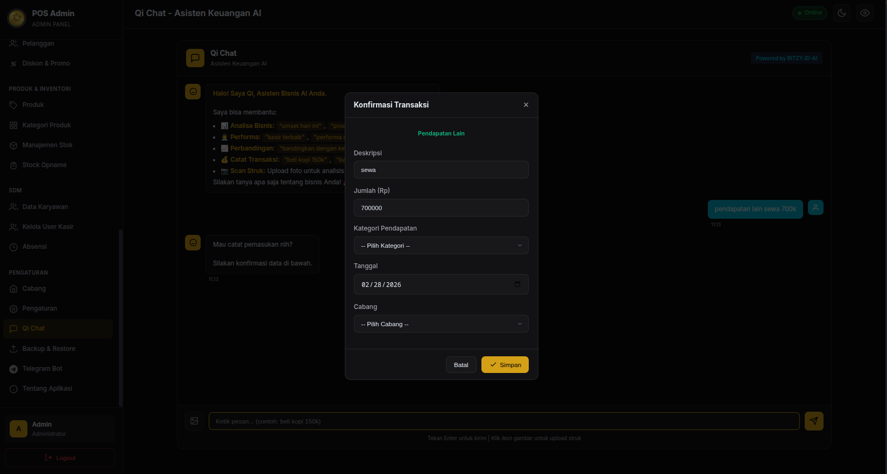

<div align="center">


# LAPOS ERP

### 🏪 Enterprise POS & Warkop ERP System — Built on Laravel 10

<p align="center">
  <strong>Not just a POS. A full-scale Business Engine featuring HRIS, Payroll, Stock Opname, and AI Analytics.</strong>
</p>

<p align="center">
  <a href="https://laravel.com"></a>
  <a href="https://php.net"></a>
  
  <a href="LICENSE"></a>
</p>

<p align="center">
  <a href="#-gambaran-sistem">Gambaran</a> •
  <a href="#-modul-utama">Modul</a> •
  <a href="#️-arsitektur--prinsip-teknis">Arsitektur</a> •
  <a href="#-quick-start-sqlite">Quick Start</a> •
  <a href="#-keamanan-yang-sudah-aktif">Keamanan</a> •
  <a href="#-troubleshooting">Troubleshooting</a>
</p>

<br>

<a href="https://e.bitzy.id">
  
</a>

</div>

---

## 📋 Gambaran Sistem

LAPOS adalah sistem ERP berbasis Laravel untuk operasional retail/F&B multi-cabang. Tidak hanya POS — mencakup **inventory**, **stock opname**, **cash register**, **kasbon**, **payroll**, dan **laporan keuangan**.

> README ini fokus ke kebutuhan **developer**, **QA**, dan **operator** agar sistem bisa dijalankan, diuji, dan dioperasikan dengan benar.

**Mode akses utama:**

| Mode | Guard | Kegunaan |
|------|-------|----------|
| 🖥️ Web Session | `cashier` | Dashboard, Admin Panel, Kasir POS |
| 🔌 API (Sanctum) | `sanctum` | Endpoint Manager & integrasi eksternal |

---

## ✨ Modul Utama

<table>
<tr>
<td width="50%" valign="top">

### 💼 Core Business & Finance

| Fitur | Deskripsi |
|-------|-----------|
| 🛒 **POS Engine** | Checkout cepat, keyboard listener, idempotent request |
| 🔐 **Cash Register / Shift** | Wajib open shift, rekonsiliasi kas saat close |
| 📦 **Inventory** | CRUD produk, stock movement, stock opname |
| 📊 **Financial Reports** | Income/expense, P&L, ekspor PDF/Excel |
| 🔄 **Redenominasi** | Toggle 3-zero currency truncation |
| 💳 **QRIS** | Pembayaran digital terintegrasi |

</td>
<td width="50%" valign="top">

### 👥 HRIS, AI & Integrations

| Fitur | Deskripsi |
|-------|-----------|
| 💰 **Payroll Engine** | Auto-generate payslip + potongan kasbon |
| 🕒 **Attendance** | Time tracking kasir & karyawan |
| 💸 **Kasbon** | Cash advance dengan cicilan otomatis |
| 🤖 **Qi Chat (AI Agent)** | Bukan sekadar chatbot — AI terintegrasi yang bisa **mengeksekusi aksi UI** (buka modal transaksi, panggil report) langsung dari perintah natural language |
| 📱 **Telegram Bot** | Settlement report harian ke HP owner |
| 🏢 **Multi-Branch** | Tenant context isolation per cabang |

</td>
</tr>
</table>

---

## 🏛️ Arsitektur & Prinsip Teknis

```text
┌────────────────────────────────────────────────────────────────┐
│  REQUEST                                                       │
│  ┌──────────┐   ┌──────────────┐   ┌────────────────────────┐ │
│  │ Middleware│──▶│ FormRequest  │──▶│  Controller (thin)     │ │
│  │ (Gate)   │   │ (Validation) │   │  ↓                     │ │
│  └──────────┘   └──────────────┘   │  Service → DB::beginTx │ │
│                                     │  ↓                     │ │
│                                     │  DTO ← Response        │ │
│                                     └────────────────────────┘ │
└────────────────────────────────────────────────────────────────┘
```

**Prinsip yang diterapkan:**

- ⚡ Controller tipis — hanya HTTP orchestration
- 📝 Validasi input via **FormRequest** (gatekeeper)
- 🧠 Business logic di `app/Services`
- 📦 DTO domain — eliminasi array mentah
- 🔒 `DB::transaction` + `lockForUpdate` untuk flow kritikal
- 💰 Integer math (minor unit) untuk semua kalkulasi uang
- 🎯 Idempotency key untuk mencegah double-submit

---

## 📂 Struktur Folder & Modul

<details>
<summary><strong>📁 Klik untuk melihat Full Architecture Tree</strong></summary>
<br>

```text
app/
├── Console/
│   └── Commands/
│       ├── CreateTenant.php
│       ├── DbCheckCommand.php
│       └── MigrateTenants.php
│
├── Domain/                              # 🏢 Domain Layer (DTOs & Business Rules)
│   ├── Inventory/DTOs/OpnameData.php
│   ├── Payroll/DTOs/PayrollRunData.php
│   ├── Report/DTOs/IncomeStatementData.php
│   └── Transaction/DTOs/CheckoutData.php
│
├── Helpers/
│   ├── CurrencyHelper.php               # Format & redenominasi mata uang
│   └── helpers.php                      # Global helper functions
│
├── Http/
│   ├── Controllers/
│   │   ├── Api/                         # 🔌 REST API Endpoints
│   │   │   ├── CashierController.php
│   │   │   ├── ManagerAuthController.php
│   │   │   ├── ManagerFinanceController.php
│   │   │   ├── QiChatController.php
│   │   │   ├── QrisController.php
│   │   │   └── V1/                      # ⚡ Enterprise API v1
│   │   │       ├── Transaction/CheckoutController.php
│   │   │       ├── Payroll/PayrollRunController.php
│   │   │       ├── Inventory/StockOpnameController.php
│   │   │       └── Report/FinancialReportController.php
│   │   │
│   │   ├── Concerns/AssertsBranchAccess.php
│   │   │
│   │   ├── # ── Web Controllers ─────────────────
│   │   ├── AnalyticsController.php
│   │   ├── BranchController.php
│   │   ├── CashAdvanceController.php
│   │   ├── CashDepositController.php
│   │   ├── CashRegisterController.php
│   │   ├── CashierController.php        # POS Kasir
│   │   ├── CashierAttendanceController.php
│   │   ├── CashierManagementController.php
│   │   ├── CashierPayrollController.php
│   │   ├── CustomerController.php
│   │   ├── DashboardController.php
│   │   ├── DiscountController.php
│   │   ├── EmployeeController.php
│   │   ├── ExpenseController.php
│   │   ├── FinancialReportController.php
│   │   ├── IncomeController.php
│   │   ├── PayrollController.php
│   │   ├── ProductController.php
│   │   ├── ProductCategoryController.php
│   │   ├── ReportController.php
│   │   ├── SettingsController.php
│   │   ├── StockAlertController.php
│   │   ├── StockController.php
│   │   ├── StockOpnameController.php
│   │   ├── TelegramBotController.php
│   │   ├── TenantController.php
│   │   ├── TransactionController.php
│   │   └── TransactionReturnController.php
│   │
│   ├── Middleware/                       # 🛡️ Security Gates
│   │   ├── CheckRole.php                # Role-based access
│   │   ├── RequireActiveShift.php       # Wajib open shift
│   │   ├── TenantMiddleware.php         # Branch isolation
│   │   ├── ThrottleLogin.php            # Rate limit login
│   │   ├── CheckDeviceRegistration.php  # Device whitelist
│   │   └── DeveloperAuth.php            # Dev panel access
│   │
│   └── Requests/                        # 📝 Form Validation (Gatekeepers)
│       ├── Transaction/CheckoutRequest.php
│       ├── Inventory/SubmitOpnameRequest.php
│       ├── Payroll/
│       │   ├── GeneratePayrollRequest.php
│       │   ├── GenerateCashierPayrollRequest.php
│       │   ├── GenerateMonthlyPayrollRequest.php
│       │   ├── CashierPayrollFilterRequest.php
│       │   ├── UpdateCashierPayrollRequest.php
│       │   └── UpdateCashierSalarySettingsRequest.php
│       ├── Report/
│       │   ├── IncomeStatementRequest.php
│       │   └── FinancialReportFilterRequest.php
│       ├── CashAdvance/
│       │   ├── StoreCashAdvanceRequest.php
│       │   └── RecordCashAdvancePaymentRequest.php
│       └── Cashier/
│           ├── StoreCashierRequest.php
│           └── UpdateCashierRequest.php
│
├── Models/                              # 💾 Eloquent ORM (38 Models)
│   ├── # ── Core POS ──────────────────
│   ├── Transaction.php, TransactionDetail.php
│   ├── TransactionPayment.php
│   ├── TransactionReturn.php, TransactionReturnDetail.php
│   ├── Product.php, ProductCategory.php
│   ├── Customer.php, CustomerPoint.php
│   ├── Discount.php
│   │
│   ├── # ── Inventory ─────────────────
│   ├── StockMovement.php, StockOpname.php, StockOpnameDetail.php
│   ├── StockAlert.php
│   │
│   ├── # ── HRIS / Payroll ────────────
│   ├── Employee.php, Cashier.php
│   ├── Attendance.php, CashierAttendance.php
│   ├── Payroll.php, CashierPayroll.php
│   ├── CashAdvance.php
│   │
│   ├── # ── Finance ───────────────────
│   ├── Income.php, IncomeCategory.php
│   ├── Expense.php, ExpenseCategory.php
│   ├── CashRegister.php, CashDeposit.php
│   │
│   ├── # ── System / Multi-Tenant ─────
│   ├── Branch.php, Tenant.php
│   ├── StoreSetting.php, AppSetting.php, AppLicense.php
│   ├── WorkShift.php, RegisteredDevice.php
│   ├── TelegramUser.php
│   └── Developer.php, DeveloperLog.php, DatabaseBackup.php
│
├── Services/                            # ⚙️ Business Logic Layer
│   ├── Transaction/
│   │   ├── CheckoutService.php          # Core checkout + locking
│   │   ├── CheckoutProcessException.php
│   │   ├── DatabaseBusyException.php
│   │   ├── InsufficientPaymentException.php
│   │   ├── InvalidCheckoutException.php
│   │   └── OutOfStockException.php
│   │
│   ├── Inventory/
│   │   ├── StockOpnameService.php       # Immutable opname + locking
│   │   ├── OpnameProcessException.php
│   │   └── OpnameIgnoredException.php
│   │
│   ├── Payroll/
│   │   ├── PayrollGenerationService.php
│   │   ├── EmployeePayrollWebService.php
│   │   ├── CashierPayrollWebService.php
│   │   ├── CashierPayroll/
│   │   │   ├── CashierPayrollGenerationService.php
│   │   │   ├── CashierPayrollLifecycleService.php
│   │   │   ├── CashierPayrollReadService.php
│   │   │   ├── CashierPayrollScopeService.php
│   │   │   └── CashierPayrollSettingsService.php
│   │   ├── PayrollCalculationException.php
│   │   └── PayrollWebException.php
│   │
│   ├── Report/
│   │   ├── FinancialReportService.php   # P&L, integer math, midnight-safe
│   │   ├── FinancialReportWebService.php
│   │   ├── FinancialReportLedgerExportService.php
│   │   └── ReportScopeResolver.php
│   │
│   ├── CashAdvance/
│   │   ├── CashAdvanceWebService.php
│   │   └── CashAdvanceWebException.php
│   │
│   ├── Cashier/
│   │   └── CashierManagementService.php
│   │
│   ├── TransactionService.php           # Legacy (transisi bertahap)
│   └── QrisGenerator.php
│
└── Traits/
    └── ApiResponse.php                  # Standardized JSON responses
```

</details>

### 📊 Peta Modul ERP (Request → Service → Response)

| Modul | DTO | FormRequest | Service | Controller | Route |
|:------|:----|:------------|:--------|:-----------|:------|
| **Checkout** | `CheckoutData` | `CheckoutRequest` | `CheckoutService` | `Api/V1/.../CheckoutController` | `POST /api/v1/transaction/checkout` |
| **Payroll** | `PayrollRunData` | `GeneratePayrollRequest` | `PayrollGenerationService` | `Api/V1/.../PayrollRunController` | `POST /api/v1/payroll/run` |
| **Stock Opname** | `OpnameData` | `SubmitOpnameRequest` | `StockOpnameService` | `Api/V1/.../StockOpnameController` | `POST /api/v1/inventory/opname` |
| **Laporan Keuangan** | `IncomeStatementData` | `IncomeStatementRequest` | `FinancialReportService` | `Api/V1/.../FinancialReportController` | `GET /api/v1/report/income-statement` |
| **Kasbon** | — | `StoreCashAdvanceRequest` | `CashAdvanceWebService` | `CashAdvanceController` | `/cash-advances` |
| **Payroll Kasir** | — | `GenerateCashierPayrollRequest` | `CashierPayrollWebService` | `CashierPayrollController` | `/cashier-payrolls` |
| **Cash Register** | — | *(controller validation)* | Middleware `RequireActiveShift` | `CashRegisterController` | `/cash-registers/*` |
| **POS Web** | — | *(CSRF + web)* | `CheckoutService` (transisi) | `CashierController` | `/cashier/pos` |

---

## 🚀 Quick Start (SQLite)

<div align="center">

<table>
<tr>
<td align="center"><br><sub>PHP 8.2+</sub></td>
<td align="center"><br><sub>Composer 2.x</sub></td>
<td align="center"><br><sub>Default Dev DB</sub></td>
</tr>
</table>

</div>

```bash
# 1️⃣ Clone & install
git clone https://github.com/bicknicktick/LAPOS-kasir.git
cd LAPOS-kasir
composer install

# 2️⃣ Environment
cp .env.example .env
php artisan key:generate

# 3️⃣ Database
touch database/database.sqlite
php artisan migrate --seed

# 4️⃣ Launch
php artisan serve --host=127.0.0.1 --port=8090
```

> 🎉 Akses di `http://127.0.0.1:8090`

<details>
<summary><strong>🐘 Setup MySQL / PostgreSQL (Produksi)</strong></summary>

**MySQL:**
```env
DB_CONNECTION=mysql
DB_HOST=127.0.0.1
DB_PORT=3306
DB_DATABASE=lapos
DB_USERNAME=root
DB_PASSWORD=secret
```

**PostgreSQL:**
```env
DB_CONNECTION=pgsql
DB_HOST=127.0.0.1
DB_PORT=5432
DB_DATABASE=lapos
DB_USERNAME=postgres
DB_PASSWORD=secret
```

Lalu: `php artisan migrate --seed`

</details>

---

## 👤 Bootstrap Data Awal

Pada fresh database, buat admin + kasir pertama:

```bash
php artisan db:seed --class=CashierSeeder
```

### 🔑 Akun Login & Role

| Role | Username | PIN | Akses |
|------|----------|-----|-------|
| `admin` | Admin | 123456 | Seluruh modul operasional |
| `cashier` | Kasir1 | 111111 | POS harian + proses shift |
| `superadmin` | — | — | Seluruh modul + tenant scope |
| `manager` | — | — | Operasional + pelaporan |

> 🔴 **DANGER / CRITICAL WARNING:**
> PIN `123456` dan `111111` **HANYA untuk environment `local`**.
> Anda **WAJIB MUTLAK** mereset PIN ini melalui database atau menu Admin **segera setelah aplikasi di-deploy ke Production!**
> Gagal melakukan ini = **membuka pintu belakang untuk siapa saja yang tahu default PIN.**

---

## 🔄 Workflow Operasional

### Kasir (Harian)

```text
Login → Open Shift → POS Checkout → Close Shift
  │                                      │
  └─ /cash-registers/open          /cash-registers/close
```

> ⚠️ Middleware `require.shift` akan **menolak** akses POS jika kasir belum open shift.

### Admin / Manager

```text
Login → Dashboard → Master Data → Financial Reports → Settlement
  │        │            │                │
  │   /reports/    /products,       /financial-reports
  │   dashboard    /cashiers
```

---

## 🔌 Endpoint API Penting

<details>
<summary><strong>Klik untuk melihat semua endpoint</strong></summary>

### 🔐 Auth

| Method | Endpoint | Deskripsi |
|--------|----------|-----------|
| `POST` | `/api/cashier/login` | Login kasir (name + pin) |
| `POST` | `/api/manager/login` | Login manager (Sanctum) |
| `POST` | `/api/manager/logout` | Logout manager |

### ⚡ Enterprise API v1

| Method | Endpoint | Service |
|--------|----------|---------|
| `POST` | `/api/v1/transaction/checkout` | `CheckoutService` |
| `POST` | `/api/v1/payroll/run` | `PayrollGenerationService` |
| `POST` | `/api/v1/inventory/opname` | `StockOpnameService` |
| `GET` | `/api/v1/report/income-statement` | `FinancialReportService` |

> **Rate Limit:** Login endpoints are strictly rate limited.

</details>

---

## 🔒 Keamanan yang Sudah Aktif

| Layer | Implementasi | File |
|-------|-------------|------|
| 🛡️ Role Gate | Middleware `check.role` | `CheckRole.php` |
| ⏰ Shift Enforcement | Middleware `require.shift` | `RequireActiveShift.php` |
| 🏢 Tenant Isolation | Branch-scoped queries | `TenantMiddleware.php` |
| 🚫 Rate Limiting | Login throttle | `ThrottleLogin.php` |
| 🔐 Session Hardening | Regenerate on login/logout | `CashierController.php` |
| 📱 Device Whitelist | Registered devices only | `CheckDeviceRegistration.php` |

> **⚠️ Coding Checklist untuk fitur baru:**
> - ❌ Jangan pakai `$request->all()` atau `$request->except()` untuk write
> - ✅ Gunakan **FormRequest** + whitelist field
> - ✅ Untuk uang/stok: **integer math** + `DB::transaction` + `lockForUpdate`

---

## ⚙️ Konfigurasi `.env`

```env
APP_NAME="LAPOS ERP"
APP_ENV=local
APP_DEBUG=true
APP_URL=http://localhost:8090

DB_CONNECTION=sqlite
# DB_DATABASE=/absolute/path/to/database/database.sqlite

CURRENCY_REDENOMINATION=false
CURRENCY_SYMBOL=Rp

SESSION_DRIVER=file
SESSION_LIFETIME=120
```

> **Production hardening:** `APP_ENV=production`, `APP_DEBUG=false`, DB server (bukan SQLite), rotasi kredensial default.

---

## 📸 Screenshots

<div align="center">

**🖥️ Enterprise Admin Dashboard (Dark Mode)**



<br><br>

<table>
<tr>
<td align="center">
<strong>🛒 POS Kasir Interface</strong><br><br>

</td>
<td align="center">
<strong>🤖 Qi Chat — AI Assistant</strong><br><br>

</td>
</tr>
<tr>
<td align="center">
<strong>📝 AI-Driven Transaction Modal</strong><br><br>

</td>
</tr>
</table>
</div>

---

## 🧪 Testing & Maintenance

```bash
php artisan test              # Jalankan test suite
php artisan route:list        # Cek semua route
php artisan optimize:clear    # Bersihkan cache
```

<details>
<summary><strong>Cache untuk production</strong></summary>

```bash
php artisan config:cache
php artisan route:cache
php artisan view:cache
```

</details>

---

## 🔧 Troubleshooting

<details>
<summary><strong>A. <code>ERR_CONNECTION_REFUSED</code> saat login API</strong></summary>

- Server Laravel tidak berjalan atau port berbeda.
- **Fix:** `php artisan serve --host=127.0.0.1 --port=8090`

</details>

<details>
<summary><strong>B. Asset 503 / Service Worker stale</strong></summary>

1. Hard reload (`Ctrl+Shift+R`)
2. DevTools → Application → Service Workers → Unregister
3. Clear site data, reload.

</details>

<details>
<summary><strong>C. Login gagal</strong></summary>

1. User ada dan `is_active = true`
2. Role sesuai (`cashier` untuk POS, `admin` untuk dashboard)
3. PIN 6 digit valid
4. Reset via tinker:
```bash
php artisan tinker --execute='use App\Models\Cashier; use Illuminate\Support\Facades\Hash; $u=Cashier::where("name","Admin")->first(); $u->pin=Hash::make("123456"); $u->is_active=true; $u->save();'
```

</details>

<details>
<summary><strong>D. <code>403 shift_required</code></strong></summary>

Kasir belum open shift. Buka `/cash-registers/open` → isi modal awal → ulangi checkout.

</details>

<details>
<summary><strong>E. Checkout <code>422 Unprocessable</code></strong></summary>

- Payload tidak sesuai validasi (items kosong, payment kurang).
- Cek tab Network → detail `errors` JSON.
- Pastikan CSRF token valid.

</details>

<details>
<summary><strong>F. SQLite <code>database is locked</code></strong></summary>

- Terlalu banyak write paralel. Kurangi spam checkout.
- Untuk produksi → pindah ke MySQL/PostgreSQL.

</details>

<details>
<summary><strong>G. Turbo: <code>Identifier already declared</code></strong></summary>

- Script dieksekusi ulang saat Turbo render.
- **Fix:** Guard global (`if (window.X) return;`), atau `data-turbo-eval="false"`.

</details>

<details>
<summary><strong>H. Tombol modal tidak bisa diklik</strong></summary>

- Z-index konflik backdrop/modal.
- Event handler bind berulang.
- **Fix:** Periksa CSS z-index, gunakan idempotent binding.

</details>

---

## 🚢 Deploy

Rujuk dokumen:
- `DEPLOYMENT.md` — Panduan deploy lengkap
- `VPS-ACCESS.md` — Akses server
- `deploy-*.sh` — Script deploy otomatis

**Minimum hardening:**
1. `APP_DEBUG=false` + HTTPS
2. DB server terkelola (bukan SQLite)
3. Backup terjadwal + rotasi kredensial

---

## 📚 Dokumen Pendukung

| Dokumen | Deskripsi |
|---------|-----------|
| `USER-GUIDE.md` | Panduan operasional user |
| `FEATURES.md` | Ringkasan fitur |
| `CHANGELOG.md` | Riwayat perubahan |
| `QIAI_AUDIT.md` | Catatan audit |
| `SUPERPOWERS.md` | Fitur enterprise lanjutan |

---

## 📝 Lisensi

MIT License — see [LICENSE](LICENSE).

<div align="center">
<br>

<a href="https://paypal.me/bitzyid">
  
</a>

<br><br>

<strong>Developed with ❤️ by <a href="https://e.bitzy.id">e.bitzy.id</a></strong>

<sub>© 2026 LAPOS ERP — All rights reserved.</sub>

</div>
